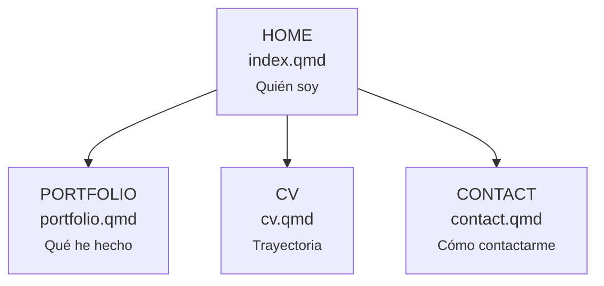

# Estructura de páginas — Portafolio

> **Versión vigente:** v9.0  
> **Estado:** arquitectura simplificada e implementada.  
> **Propósito:** eliminar redundancia y concentrar el detalle técnico en una única página Portfolio.

---

# 1. Arquitectura pública vigente



Versión textual:

```text
HOME — index.qmd
│
├── PORTFOLIO — portfolio.qmd
│   ├── Master's Research
│   │   ├── Objective 1
│   │   ├── Objective 2
│   │   └── Objective 3
│   ├── Robotics & Rehabilitation
│   │   ├── CYBATHLON
│   │   └── CandelStim
│   ├── Organ Preservation & Transplantation
│   │   ├── Borealis
│   │   └── Preservation Machine
│   ├── Medical Imaging & AI
│   │   └── U-Net
│   ├── Embedded Systems & FPGA
│   │   └── Universal Testing Machine
│   └── CAD & Prototyping
│       └── Vscan Air
│
├── CV — cv.qmd
│
└── CONTACT — contact.qmd
```

---

# 2. Función única de cada página

| Página | Pregunta que responde | Contenido |
|---|---|---|
| `index.qmd` | ¿Quién es Carlos Moreno? | Perfil, investigación actual, trabajo seleccionado y áreas de ingeniería. |
| `portfolio.qmd` | ¿Qué ha investigado / construido? | Único archivo técnico de proyectos, imágenes, diagramas, contribución y validación. |
| `cv.qmd` | ¿Cuál es su trayectoria? | Formación, experiencia, investigación, liderazgo, skills e idiomas. |
| `contact.qmd` | ¿Cómo puedo contactarlo? | Contacto y perfiles profesionales. |

Regla anti-redundancia:

```text
Home      → presentación
Portfolio → evidencia técnica
CV        → trayectoria
Contact   → contacto
```

Una página no debe convertirse en una copia de otra.

---

# 3. Portfolio como único documento técnico

No existen páginas QMD individuales por proyecto.

El contenido técnico vive exclusivamente en:

```text
portfolio.qmd
```

Los seis grupos principales son:

```text
MASTER'S RESEARCH — LIVER VIABILITY & ICG-NIR
ROBOTICS & REHABILITATION
ORGAN PRESERVATION & TRANSPLANTATION
MEDICAL IMAGING & AI
EMBEDDED SYSTEMS & FPGA
CAD & PROTOTYPING
```

La navegación lateral mantiene dos niveles visibles.

---

# 4. Compatibilidad con URLs antiguas

Los antiguos archivos:

```text
projects/thesis.qmd
projects/cybathlon.qmd
projects/candel.qmd
projects/borealis.qmd
projects/organ-preservation.qmd
projects/unet.qmd
projects/fpga.qmd
projects/vscan.qmd
```

fueron eliminados.

Para evitar errores 404 desde bookmarks o enlaces antiguos, existe únicamente una capa de redirección estática:

```text
projects/index.html                 → ../portfolio.html
projects/thesis.html                → ../portfolio.html#masters-research
projects/cybathlon.html             → ../portfolio.html#cybathlon
projects/candel.html                → ../portfolio.html#candelstim
projects/borealis.html              → ../portfolio.html#borealis
projects/organ-preservation.html    → ../portfolio.html#organ-preservation-machine
projects/unet.html                  → ../portfolio.html#unet
projects/fpga.html                  → ../portfolio.html#fpga
projects/vscan.html                 → ../portfolio.html#vscan
```

Estas páginas no contienen documentación de proyecto; solo preservan compatibilidad de URLs.

---

# 5. Navegación superior

La barra superior contiene únicamente:

```text
Carlos Moreno Rojas → Home
Portfolio           → portfolio.qmd
CV                  → cv.qmd
Contact             → contact.qmd
```

No existe:

```text
Project Pages
Search
```

El único Swiss Control visible es Light/Dark.

---

# 6. Archivos públicos principales

```text
index.qmd
portfolio.qmd
cv.qmd
contact.qmd

assets/
downloads/
projects/   ← redirects de compatibilidad, no project pages
```

No se deben volver a crear páginas QMD individuales salvo una decisión explícita futura registrada primero en `PORTFOLIO_REQUIREMENTS.md`.
