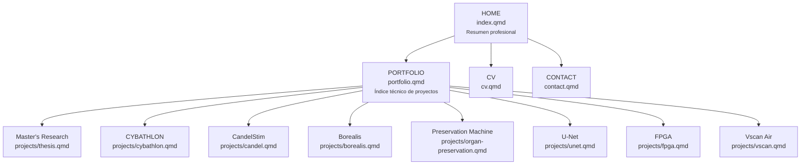

# Estructura de páginas — Portafolio

> **Versión vigente:** v7.5  
> **Estado:** arquitectura aprobada e implementada.  
> **Propósito:** mantener una estructura simple, sin un índice intermedio redundante.

---

# 1. Arquitectura pública vigente



Versión textual:

```text
HOME — index.qmd
│
├── PORTFOLIO — portfolio.qmd
│   ├── Master's Research
│   │   └── projects/thesis.qmd
│   ├── CYBATHLON
│   │   └── projects/cybathlon.qmd
│   ├── CandelStim
│   │   └── projects/candel.qmd
│   ├── Borealis
│   │   └── projects/borealis.qmd
│   ├── Preservation Machine
│   │   └── projects/organ-preservation.qmd
│   ├── U-Net
│   │   └── projects/unet.qmd
│   ├── FPGA
│   │   └── projects/fpga.qmd
│   └── Vscan Air
│       └── projects/vscan.qmd
│
├── CV — cv.qmd
│
└── CONTACT — contact.qmd
```

---

# 2. Regla de navegación

La barra superior pública debe contener únicamente:

```text
Carlos Moreno Rojas → Home
Portfolio           → portfolio.qmd
CV                  → cv.qmd
Contact             → contact.qmd
```

No existe una página pública intermedia llamada:

```text
Project Pages
```

ni un enlace equivalente en el navbar.

---

# 3. Función de cada nivel

| Página | Función | Nivel de detalle |
|---|---|---|
| `index.qmd` | Quién soy, investigación actual, áreas y proyectos destacados. | Bajo |
| `portfolio.qmd` | Índice técnico y resumen intermedio de todos los proyectos. | Medio |
| `projects/*.qmd` | Desarrollo técnico completo de cada proyecto. | Alto |
| `cv.qmd` | Formación, experiencia, proyectos y habilidades en formato curricular. | Medio |
| `contact.qmd` | Contacto, perfiles y documentos. | Bajo |

La cantidad de información debe crecer así:

```text
HOME < PORTFOLIO < PROJECT PAGE
```

---

# 4. Portfolio como único índice técnico

`portfolio.qmd` es el único índice general de proyectos.

Debe:

1. mantener los seis títulos principales definidos en `PORTFOLIO_REQUIREMENTS.md`;
2. mostrar un resumen técnico de cada proyecto;
3. incluir un botón `Open detailed project` para acceder a la página individual correspondiente.

Rutas:

```text
Master's Research      → projects/thesis.qmd
CYBATHLON              → projects/cybathlon.qmd
CandelStim             → projects/candel.qmd
Borealis               → projects/borealis.qmd
Preservation Machine   → projects/organ-preservation.qmd
U-Net                  → projects/unet.qmd
FPGA                    → projects/fpga.qmd
Vscan Air               → projects/vscan.qmd
```

---

# 5. Regla anti-redundancia

No se debe volver a crear una página cuyo único objetivo sea repetir la lista de proyectos ya disponible en `portfolio.qmd`.

Un mismo proyecto puede aparecer en Home, Portfolio y su página individual, pero con distinta profundidad:

```text
Home
→ una mención / selección

Portfolio
→ resumen técnico

Project page
→ documentación completa
```

---

# 6. Archivos públicos principales

```text
index.qmd
portfolio.qmd
cv.qmd
contact.qmd

projects/
├── thesis.qmd
├── cybathlon.qmd
├── candel.qmd
├── borealis.qmd
├── organ-preservation.qmd
├── unet.qmd
├── fpga.qmd
└── vscan.qmd
```

`projects/index.qmd` fue eliminado en v7.5 por redundancia.
