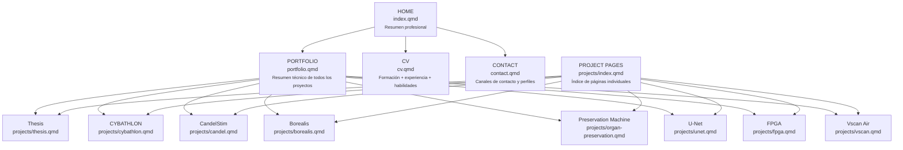
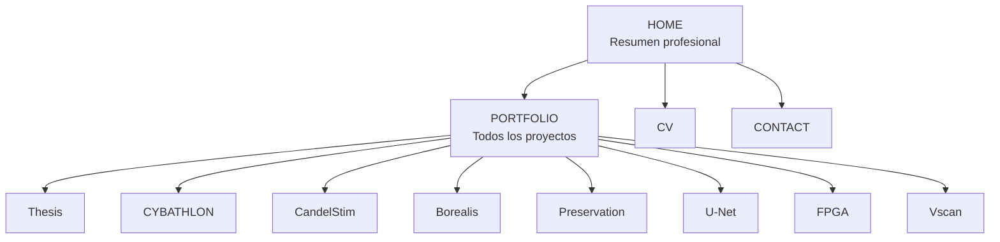

# Estructura de páginas — Portafolio

> **Versión analizada:** v7.4  
> **Propósito:** visualizar qué páginas existen, qué función cumple cada una y dónde hay posible redundancia.  
> **Estado:** documento de arquitectura; **no agrega una página nueva al sitio público**.

---

# 1. Diagrama simple actual



Versión textual equivalente:

```text
HOME — index.qmd
│
├── PORTFOLIO — portfolio.qmd
│   ├── Thesis
│   ├── CYBATHLON
│   ├── CandelStim
│   ├── Borealis
│   ├── Preservation Machine
│   ├── U-Net
│   ├── FPGA
│   └── Vscan Air
│
├── CV — cv.qmd
│
└── CONTACT — contact.qmd

PROJECT PAGES — projects/index.qmd
│
├── Thesis
├── CYBATHLON
├── CandelStim
├── Borealis
├── Preservation Machine
├── U-Net
├── FPGA
└── Vscan Air
```

---

# 2. Función que debería cumplir cada página

| Página | Función principal | Nivel de detalle |
|---|---|---|
| `index.qmd` | Presentarse rápidamente: quién soy, qué hago y cuáles son mis áreas/proyectos principales. | Bajo |
| `portfolio.qmd` | Mostrar el conjunto de proyectos con contexto técnico suficiente para decidir cuál abrir. | Medio |
| `projects/*.qmd` | Documentar en profundidad cada proyecto. | Alto |
| `cv.qmd` | Mostrar trayectoria académica/profesional de forma cronológica y curricular. | Medio |
| `contact.qmd` | Facilitar contacto y acceso a perfiles/documentos. | Bajo |
| `projects/index.qmd` | Índice intermedio hacia páginas individuales. | Bajo |

---

# 3. Dónde existe redundancia actualmente

## 3.1 Home ↔ Portfolio

Existe un solapamiento **intencional y útil**, siempre que se controle el nivel de detalle.

```text
HOME
→ menciona proyectos destacados brevemente

PORTFOLIO
→ explica técnicamente cada proyecto de manera intermedia
```

No deberían repetir párrafos completos.

**Recomendación:** mantener ambos.

---

## 3.2 Portfolio ↔ páginas individuales

También existe solapamiento, pero debería funcionar como una jerarquía:

```text
Portfolio
→ problema + contribución + resultado resumido

Página individual
→ arquitectura + desarrollo + pruebas + imágenes + resultados + referencias
```

**Recomendación:** mantener ambos, pero evitar que `portfolio.qmd` se convierta en una copia larga de cada página individual.

---

## 3.3 Project Pages ↔ Portfolio

Este es el solapamiento **más fuerte** de la arquitectura actual.

Los dos permiten llegar a los mismos ocho proyectos:

```text
portfolio.qmd
        ↓
página individual

projects/index.qmd
        ↓
página individual
```

La diferencia es que `portfolio.qmd` contiene contexto técnico, mientras `projects/index.qmd` es principalmente un índice.

### Posible simplificación futura

```text
HOME
├── PORTFOLIO
│   └── páginas individuales
├── CV
└── CONTACT
```

y retirar `Project Pages` de la barra superior.

**No implementado en v7.4.**  
Debe decidirse explícitamente antes de eliminar esta página.

---

# 4. Arquitectura simplificada recomendada

Si en una versión futura se decide reducir navegación, la estructura más simple sería:



```text
HOME
├── PORTFOLIO
│   ├── Thesis
│   ├── CYBATHLON
│   ├── CandelStim
│   ├── Borealis
│   ├── Preservation
│   ├── U-Net
│   ├── FPGA
│   └── Vscan
├── CV
└── CONTACT
```

Esto elimina únicamente el **índice intermedio `Project Pages`**, no las páginas detalladas de proyectos.

---

# 5. Regla de contenido recomendada

Para evitar que el sitio vuelva a crecer de forma redundante:

```text
HOME
máximo: resumen

PORTFOLIO
máximo: ficha técnica intermedia

PROJECT PAGE
máximo: documentación completa

CV
máximo: información curricular

CONTACT
máximo: contacto y enlaces
```

Un mismo proyecto puede aparecer en varios niveles, pero la cantidad de información debe crecer así:

```text
Home < Portfolio < Project Page
```

---

# 6. Decisión pendiente

La arquitectura actual se mantiene en v7.4.

La principal decisión pendiente es:

```text
¿Mantener "Project Pages" como página independiente
o
eliminarla del navbar y usar Portfolio como único índice de proyectos?
```

Hasta que esta decisión se tome, **no se elimina ninguna página ni contenido**.
