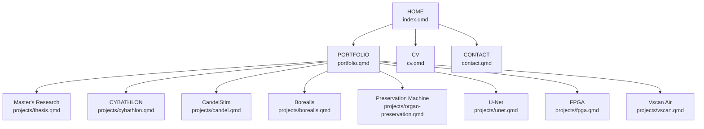

# Estructura de páginas — Portafolio

> **Versión vigente:** v7.6  
> **Estado:** arquitectura pública aprobada.



La estructura pública es únicamente:

```text
HOME — index.qmd
│
├── PORTFOLIO — portfolio.qmd
│   ├── projects/thesis.qmd
│   ├── projects/cybathlon.qmd
│   ├── projects/candel.qmd
│   ├── projects/borealis.qmd
│   ├── projects/organ-preservation.qmd
│   ├── projects/unet.qmd
│   ├── projects/fpga.qmd
│   └── projects/vscan.qmd
│
├── CV — cv.qmd
│
└── CONTACT — contact.qmd
```

## Reglas

- `Portfolio` es el único índice general de proyectos.
- Cada proyecto del Portfolio termina con un botón hacia su página detallada.
- No existe `Project Pages` ni `projects/index.qmd`.
- La barra superior contiene únicamente `Portfolio`, `CV` y `Contact`; el nombre `Carlos Moreno Rojas` lleva a Home.
- El buscador de Quarto está desactivado.
- El CV comienza con dos descargas directas:
  - Research CV.
  - Engineering / Work CV.
