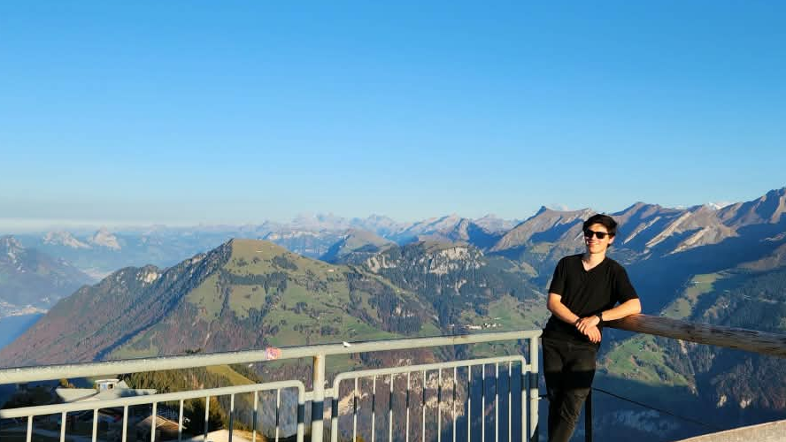
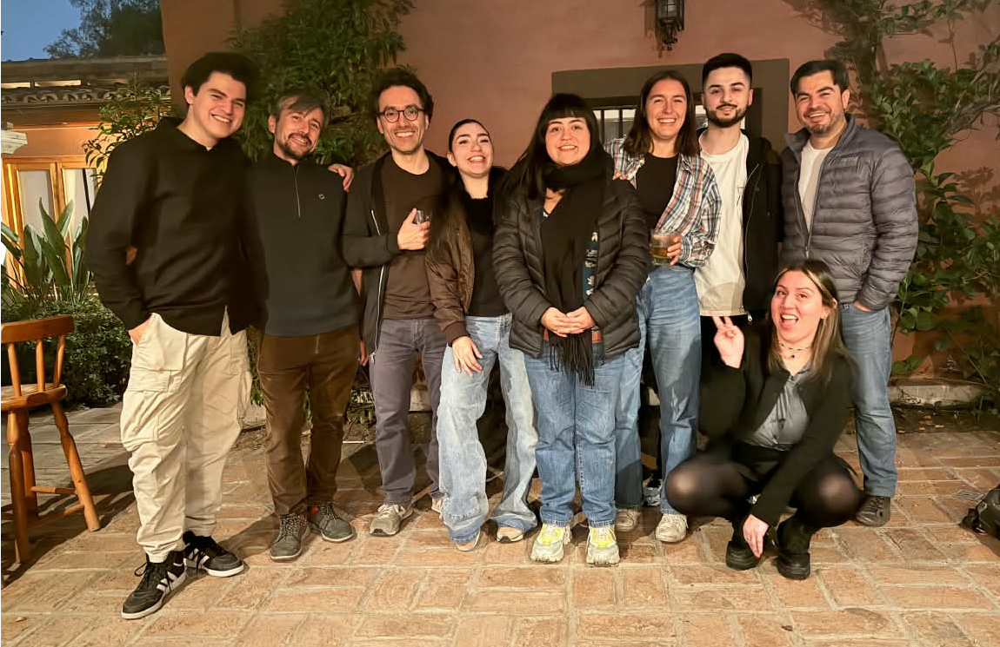
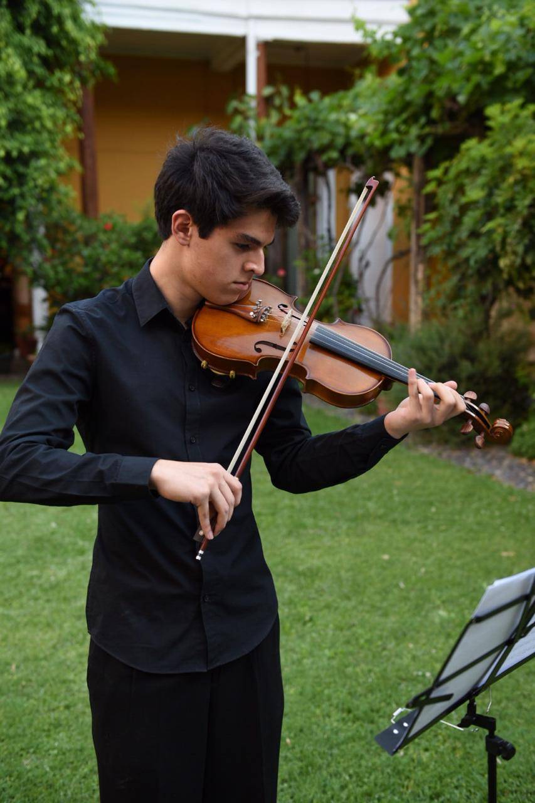
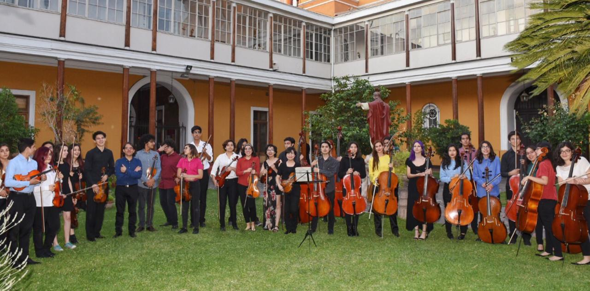
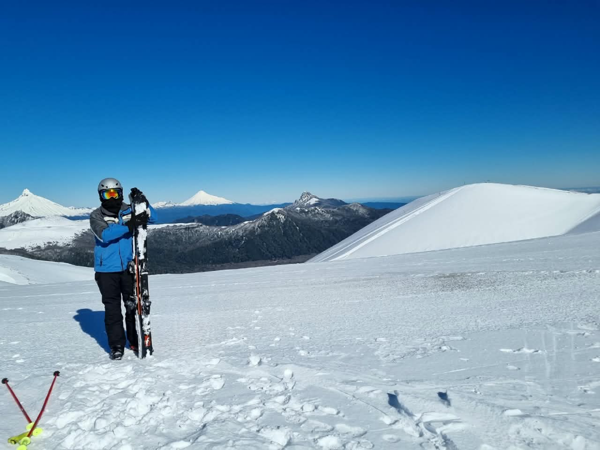
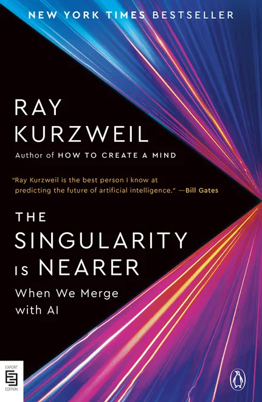

:::: {.home-intro}

::: {.home-intro-copy}

::: {.home-kicker}
BIOMEDICAL ENGINEERING · ELECTRICAL ENGINEERING
:::

::: {.home-statement}
I develop and integrate engineering systems for biomedical research, medical devices and experimental platforms.
:::

My work combines electronics, embedded systems, biomedical instrumentation, signal and image processing,
optics, CAD, prototyping and experimental validation. I am particularly interested in problems where
hardware, software and physiology have to work as one system.

::: {.home-actions}
[Technical Portfolio](portfolio.qmd){.home-action .primary}
[Curriculum Vitae](cv.qmd){.home-action}
[Contact](contact.qmd){.home-action}
:::

:::

::: {.image-slot .home-portrait}



::: {.slot-label}
hola
:::

:::

::::

# Profile

## Biomedical & Electrical Engineering

I have interdisciplinary training in **Biomedical Engineering and Electrical Engineering**, with experience
across biomedical research, electronics, embedded systems, medical devices, robotics, medical imaging,
FPGA, CAD and experimental system integration.

My engineering approach is implementation-oriented: define the physiological or technical need,
translate it into measurable requirements, build the system, calibrate it, test it and iterate from data.

:::: {.home-metric-grid}

::: {.home-metric}
**Biomedical R&D**

Instrumentation, perfusion, preservation, neuroengineering and experimental validation.
:::

::: {.home-metric}
**Electronics & Embedded**

PCB, ESP32, STM32, sensors, acquisition, communications and system integration.
:::

::: {.home-metric}
**Engineering Prototyping**

CAD, mechanical integration, 3D printing, machining and iterative testing.
:::

::::

# Current Research

## Ex Vivo Liver Viability & ICG-NIR

My Master's research uses an **ex vivo rat liver perfusion model** to develop and validate the experimental
platform and establish a physiological baseline. A third objective focused on **ICG-NIR** is planned and is
currently in progress.

The research is organized in three connected objectives:

:::: {.home-step-grid}

::: {.home-step}
::: {.step-number}
01
:::
**Perfusion Platform**

Stable circulation, physiological control and instrumentation.

[View in Portfolio →](portfolio.qmd#objective-1){.inline-project-link}
:::

::: {.home-step}
::: {.step-number}
02
:::
**Physiological Baseline**

Pressure, flow, temperature, vascular resistance, pH and gases.

[View in Portfolio →](portfolio.qmd#objective-2){.inline-project-link}
:::

::: {.home-step}
::: {.step-number}
03
:::
**ICG-NIR Functional Marker**

Coming soon.

[View in Portfolio →](portfolio.qmd#objective-3){.inline-project-link}
:::

::::

## Ex Vivo Perfusion and Transplantation Laboratory TEAM -- IIBM UC

::: {.image-slot .large}



::: {.slot-label}
EQUIPO INVESTIGACIÓN MAGÍSTER

:::

:::

# Selected Work

:::: {.home-project-grid}

::: {.project-card}
::: {.project-tag}
ROBOTICS & REHABILITATION
:::
**CYBATHLON 2024 — Ciervo UC**

Electrical Area Leader for the electrical and electromechanical integration of a robotic transfemoral prosthesis.

[View in Portfolio →](portfolio.qmd#cybathlon){.inline-project-link}
:::

::: {.project-card}
::: {.project-tag}
MEDICAL DEVICES
:::
**CandelStim — Neuroengineering**

Electronics and firmware development for a transcranial electrical stimulation platform.

[View in Portfolio →](portfolio.qmd#candelstim){.inline-project-link}
:::

::: {.project-card}
::: {.project-tag}
ORGAN PRESERVATION
:::
**Borealis UC — Supercooling**

Experimental work in organ preservation, supercooling and thermal control.

[View in Portfolio →](portfolio.qmd#borealis){.inline-project-link}
:::

::: {.project-card}
::: {.project-tag}
EMBEDDED SYSTEMS & FPGA
:::
**New Rally-X — Zybo Z7**

Complete embedded implementation of New Rally-X integrating Vivado hardware, real-time graphics, framebuffer rendering, enemy AI, audio, physical controls and SD-based assets.

[View in Portfolio →](portfolio.qmd#rallyx){.inline-project-link}
:::

::::


# About Me {#about-me}

Outside engineering, I enjoy music, skiing and reading. These activities have been an important part of my life alongside my academic and engineering work.

## Music

```{=html}
<div class="about-split">

  <div class="about-copy">
    <div class="about-kicker">MUSIC</div>

    <p>
      From 2015 to 2019, I played violin with the
      <strong>Orquesta Juvenil de Providencia</strong> in Chile.
    </p>

    <p>
      I also enjoy playing guitar and ukulele, and I am currently
      learning to play piano.
    </p>
  </div>

  <div class="about-gallery about-gallery-two">

    <div class="image-slot about-image-slot">
      

      <div class="slot-label">
        VIOLIN
        <small>Playing violin</small>
      </div>
    </div>

    <div class="image-slot about-image-slot">
      

      <div class="slot-label">
        ORQUESTA JUVENIL DE PROVIDENCIA
        <small>Providencia, Chile</small>
      </div>
    </div>

  </div>

</div>
```

## Skiing

```{=html}
<div class="about-split">

  <div class="about-copy">
    <div class="about-kicker">SPORT</div>

    <p>
      I also practice skiing and enjoy it as one of my main outdoor activities.
    </p>
  </div>

  <div class="image-slot about-ski-slot">
    

    <div class="slot-label">
      SKIING
      <small>One of my main outdoor activities</small>
    </div>
  </div>

</div>
```

## Currently Reading

```{=html}
<div class="about-book-grid">

  <div class="about-book-info">

    <div class="about-kicker">CURRENTLY READING</div>

    <h3>The Singularity Is Nearer: When We Merge with AI</h3>

    <div class="about-book-author">
      Ray Kurzweil
    </div>

    <p>
      English edition.
    </p>

  </div>

  <div class="image-slot about-book-cover">
    

    <div class="slot-label">
      CURRENT BOOK
      <small>The Singularity Is Nearer — Ray Kurzweil</small>
    </div>
  </div>

</div>
```