This page is the complete technical portfolio. Projects are organized as a concise engineering record:
**problem → design → implementation → testing → results / lessons learned**.

# MASTER'S RESEARCH — LIVER VIABILITY & ICG-NIR {#masters-research}

My Master's thesis is based on an **ex vivo rat liver perfusion model**. The current work is focused on
building a stable experimental platform and characterizing its physiological baseline. The third objective,
focused on ICG-NIR, is still in progress and is therefore presented only as upcoming work.

**Experimental model:** isolated ex vivo perfusion of rat livers.

```{mermaid}
flowchart TD
    O1["Objective 1<br/>Ex Vivo Perfusion Platform"]
    O1 --> O2["Objective 2<br/>Baseline Dataset without ICG"]
    O2 --> O3["Objective 3<br/>ICG-NIR Functional Marker<br/>Coming soon"]
```

<div class="image-slot large">
  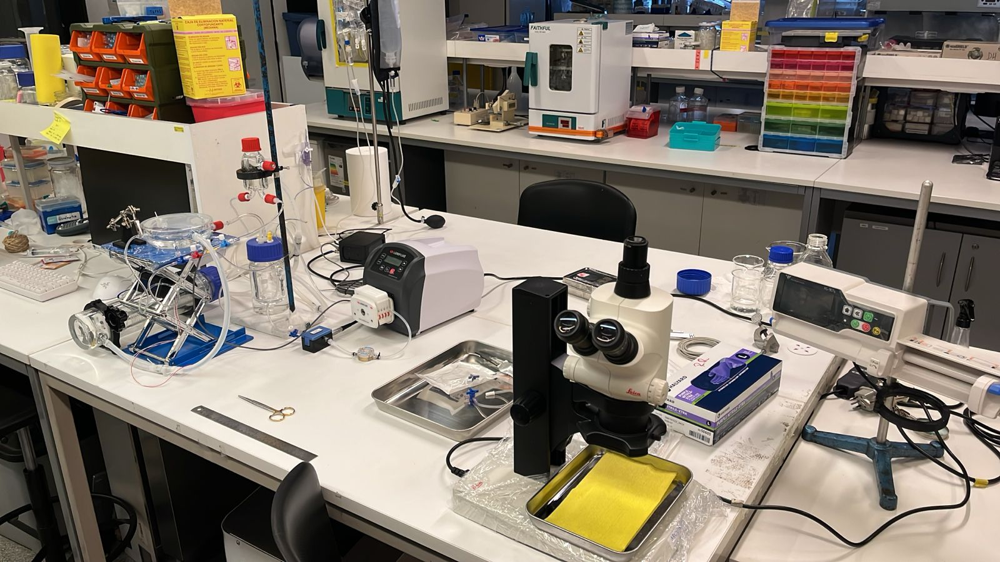
  <div class="slot-label">
    MONTAJE COMPLETO DE LA TESIS
    <small>Vista general de la plataforma y del modelo experimental ex vivo de hígado de rata</small>
  </div>
</div>

## Objective 1 — Ex Vivo Perfusion Platform {#objective-1}

Build and validate a stable and reproducible experimental platform capable of maintaining **rat livers**
under controlled ex vivo perfusion conditions.

### Perfusion circuit

```{mermaid}
flowchart LR
    A["Reservoir"] --> B["Peristaltic Pump"]
    B --> C["Pulse Damper"]
    C --> D["Flow Sensor"]
    D --> E["Oxygenator"]
    E --> F["Bubble Trap"]
    F --> G["Rat Liver"]
    G --> H["Return"]
```

<div class="image-slot large">
  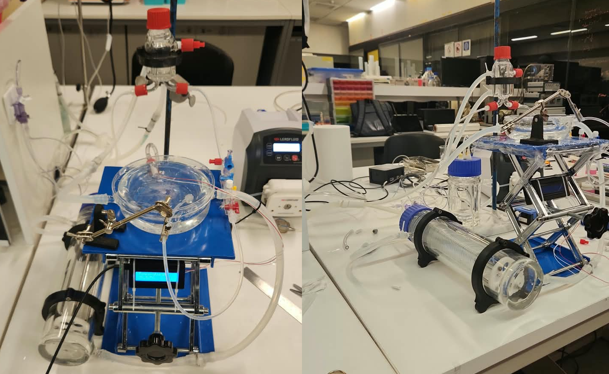
  <div class="slot-label">
    SETUP EXPERIMENTAL
    <small>Montaje del circuito de perfusión y preparación ex vivo del hígado de rata</small>
  </div>
</div>

The system combines controlled perfusate circulation, oxygenation, bubble removal and continuous
physiological monitoring.

<div class="image-slot">
  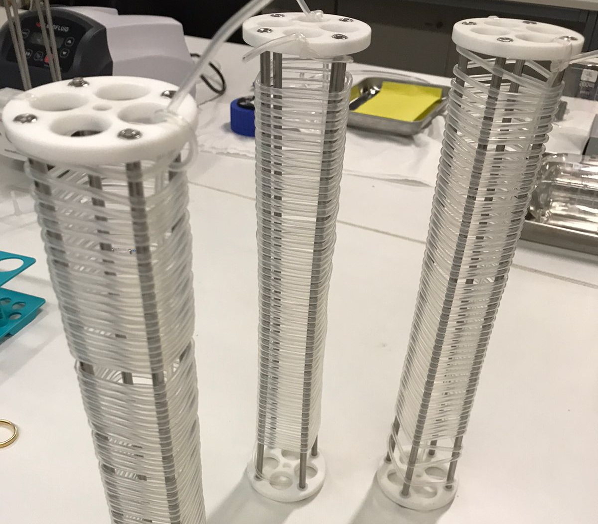
  <div class="slot-label">
    OXIGENADOR
    <small>Detalle del sistema utilizado para mantener la oxigenación del perfusato</small>
  </div>
</div>

### Monitoring

The monitoring software displays the physiological variables acquired during the experiment, including:

- **P(t):** portal / pre-liver pressure.
- **Q(t):** portal perfusion flow.
- **T(t):** perfusate / organ temperature.
- **R(t)=P/Q:** vascular resistance.

<div class="image-slot large">
  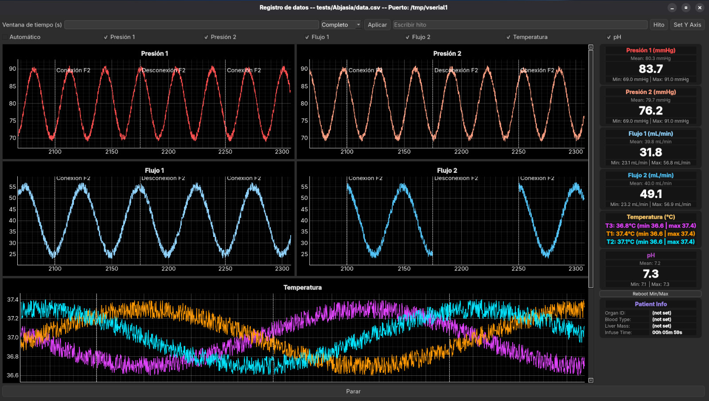
  <div class="slot-label">
    SOFTWARE DE MONITORIZACIÓN
    <small>Captura del software funcionando durante adquisición de dos canales</small>
  </div>
</div>

### Calibration and validation

Calibration and validation of the measurement chain were performed using **Fluke reference equipment**.

**Objective 1 success criterion:** a reproducible experimental window in which the rat liver remains perfused,
thermally stable and its hemodynamic variables are continuously monitored.

## Objective 2 — Baseline Dataset without ICG {#objective-2}

Characterize the stability of the preparation and establish a physiological baseline before the next experimental stage.

### Recorded variables

- Q(t) — portal flow.
- P(t) — portal pressure.
- T(t) — temperature.
- R(t)=P/Q — vascular resistance.
- pH / gases — perfusate state, when included in the protocol.

The baseline experiments are used to evaluate stability and reproducibility of the ex vivo rat liver preparation.

## Objective 3 — ICG-NIR Functional Marker {#objective-3}

**Coming soon.**

---

# ROBOTICS & REHABILITATION {#robotics-rehabilitation}

## Ciervo UC — CYBATHLON 2024 {#cybathlon}

I participated in CYBATHLON 2024 in Zürich as **Electrical Area Leader** of Ciervo UC, contributing to
the development and integration of a robotic transfemoral prosthesis for functional competition tasks.

### My role

- Electronic system design.
- Electronic prototyping and manufacturing.
- Electronics integration into the prosthesis.
- Electromechanical integration.
- Coordination between electronics, control and mechanics.
- Diagnosis and correction of integration problems.
- Development under real-world constraints and with a real user.

```{mermaid}
flowchart LR
    A["Functional need"] --> B["Design"]
    B --> C["Electronic + mechanical prototypes"]
    C --> D["Integration"]
    D --> E["Testing with pilot"]
    E --> F["Iteration"]
    F --> G["Competition-ready system"]
```

<div class="image-slot">
  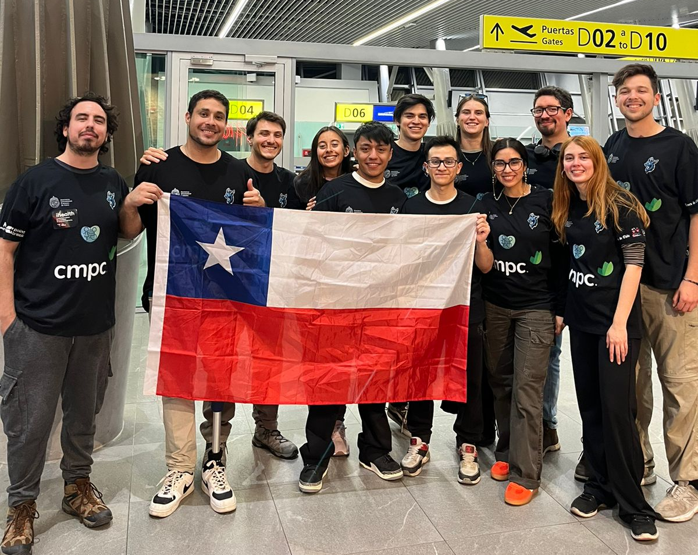
  <div class="slot-label">
    EQUIPO CIERVO UC
    <small>Registro del equipo durante el viaje a Zürich</small>
  </div>
</div>

<div class="image-slot">
  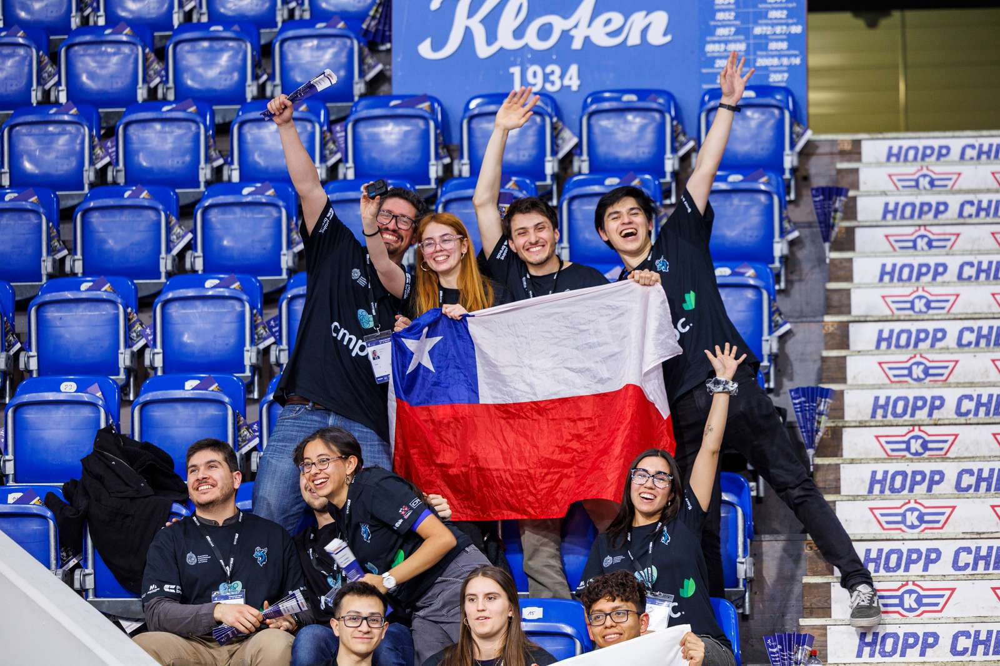
  <div class="slot-label">
    TRABAJO Y APOYO TÉCNICO
    <small>Preparación y soporte técnico del equipo Ciervo UC</small>
  </div>
</div>

<div class="image-slot large">
  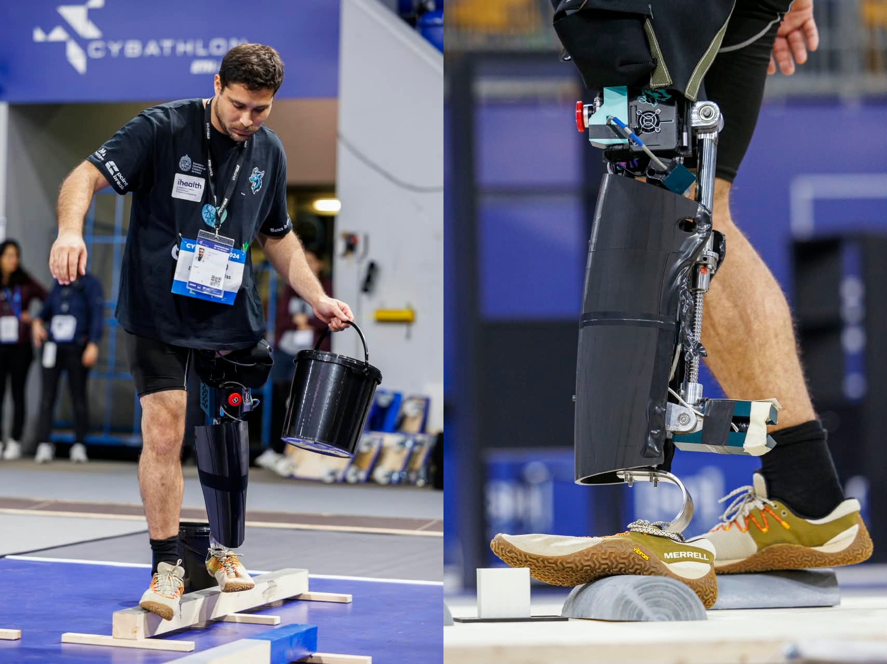
  <div class="slot-label">
    COMPITIENDO EN CYBATHLON 2024
    <small>Participación del equipo durante la competencia</small>
  </div>
</div>

<div class="image-slot">
  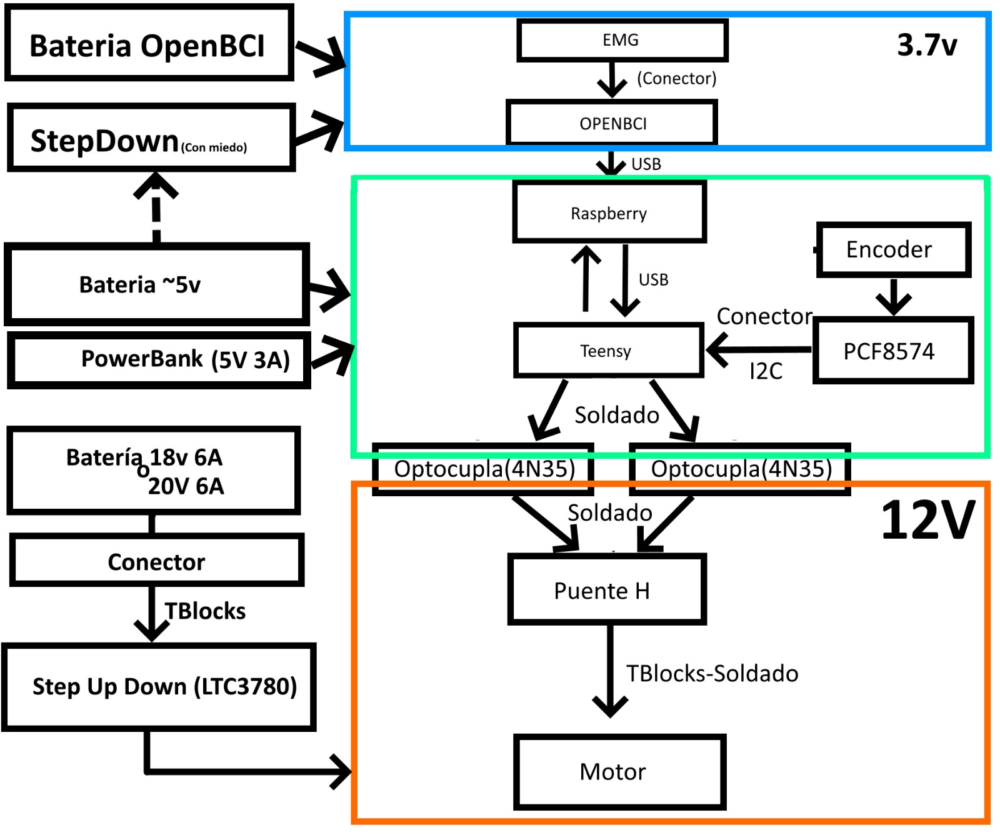
  <div class="slot-label">
    DIAGRAMA DEL SISTEMA
    <small>Diagrama técnico asociado a la prótesis y su integración</small>
  </div>
</div>

---

## CandelStim — Transcranial Electrical Stimulation {#candelstim}

Professional internship at Candel Medical Company focused on hardware, electronics and firmware for a
transcranial electrical stimulation medical device, improving an existing prototype toward a more integrated system.

### Stimulation modalities

- tDCS — transcranial direct current stimulation.
- tACS — transcranial alternating current stimulation.
- tRNS — transcranial random noise stimulation.

### Technical work

- Circuit analysis and redesign.
- Electronic component selection and simulation.
- PCB design, correction and debugging.
- ESP32 and STM32 development.
- Firmware modification and implementation.
- BLE communication.
- Signal generation and synchronization.
- Hardware/software integration.
- Energy-consumption reduction.
- Experimental validation and iterative troubleshooting.

<div class="image-slot">
  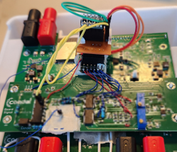
  <div class="slot-label">
    PCB / ELECTRÓNICA
    <small>PCB o electrónica desarrollada durante la práctica</small>
  </div>
</div>

<div class="image-slot">
  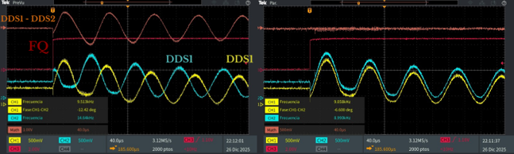
  <div class="slot-label">
    DDS / GENERACIÓN DE SEÑAL
    <small>Elemento asociado a la generación y control de señal</small>
  </div>
</div>

<div class="image-slot large">
  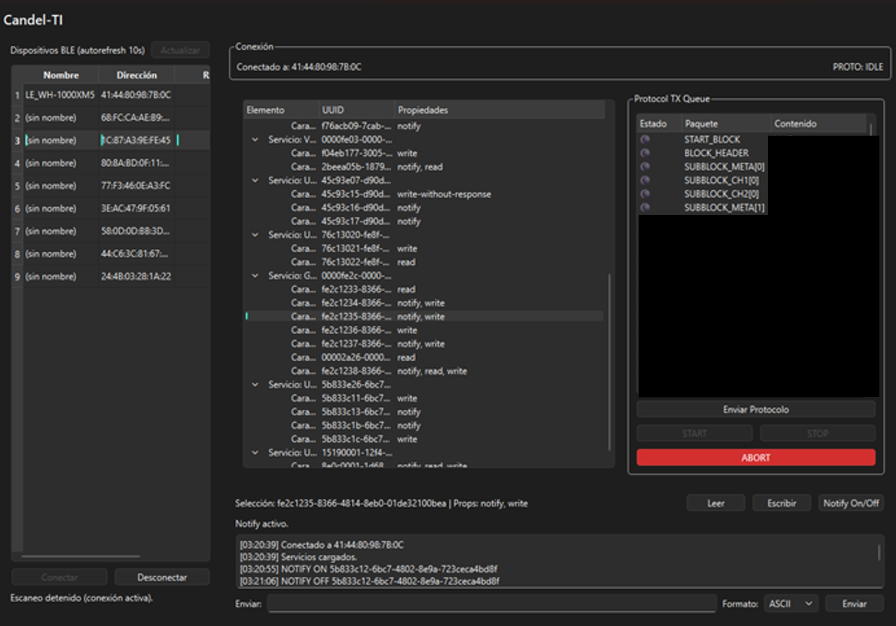
  <div class="slot-label">
    SOFTWARE
    <small>Interfaz o software asociado al sistema CandelStim</small>
  </div>
</div>

---

# ORGAN PRESERVATION & TRANSPLANTATION {#organ-preservation-transplantation}

## Borealis UC — Organ Supercooling {#borealis}

Research project focused on reducing hypoxic damage during organ transport through **supercooling**, with the
broader objective of extending preservation time and supporting transplantation.

### Engineering themes

Organ preservation · thermal control · experimental physiology · transport constraints · technology for transplantation.

<div class="image-slot large">
  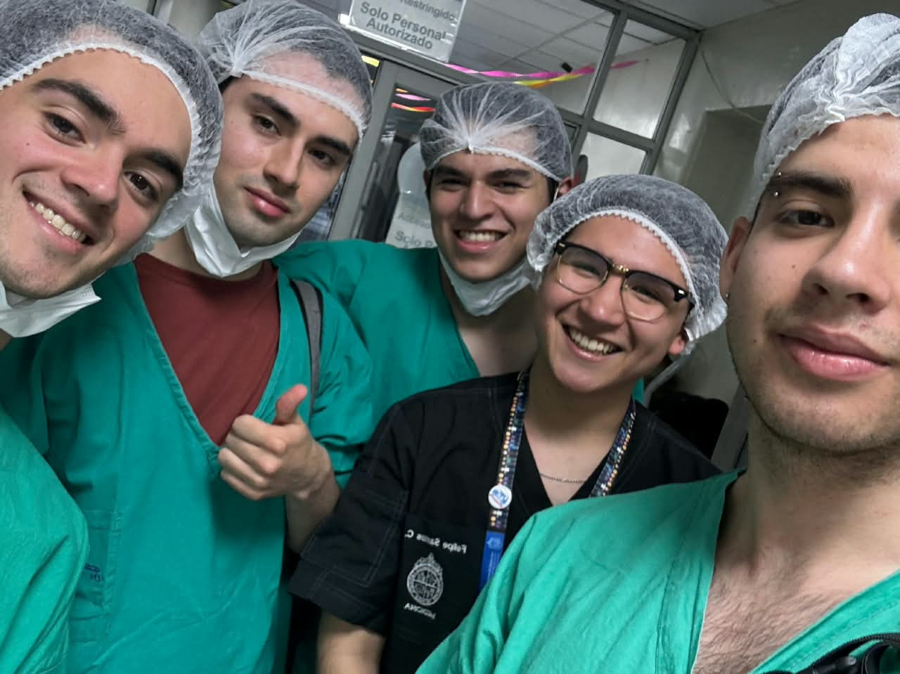
  <div class="slot-label">
    EQUIPO / SETUP BOREALIS UC
    <small>Sistema experimental o equipamiento utilizado en el proyecto</small>
  </div>
</div>

<div class="image-slot">
  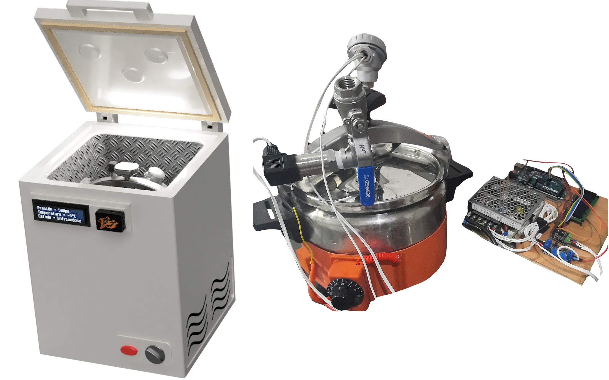
  <div class="slot-label">
    MODELO EXPERIMENTAL
    <small>Imagen del órgano o preparación utilizada en el proyecto</small>
  </div>
</div>

<div class="image-slot large">
  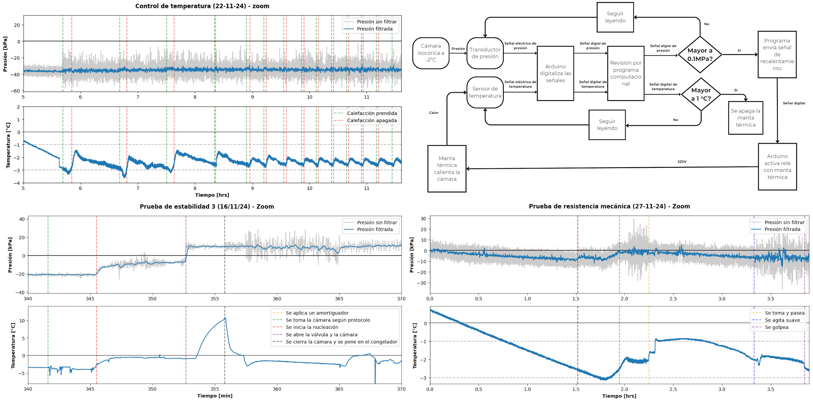
  <div class="slot-label">
    GRÁFICO EXPERIMENTAL
    <small>Resultado o evolución experimental representativa</small>
  </div>
</div>

---

## Organ Preservation Machine Redesign {#organ-preservation-machine}

Electromechanical redesign and size reduction of an organ preservation machine.

### Engineering work

- Mechanical design.
- Electronics.
- Control.
- Fluid systems.
- Electromechanical integration.
- Fabrication.
- Experimental testing.

---

# MEDICAL IMAGING & AI {#medical-imaging-ai}

## Lung Segmentation with U-Net {#unet}

Medical image segmentation project using a U-Net-based neural network for lung segmentation in CT and MRI images.

### Areas

Medical imaging · deep learning · neural networks · segmentation · biomedical image processing.

<div class="image-slot large">
  
  <div class="slot-label">
    RESULTADO VISUAL IPRE / U-NET
    <small>Visualización animada o secuencia del resultado de segmentación</small>
  </div>
</div>

<div class="image-slot large">
  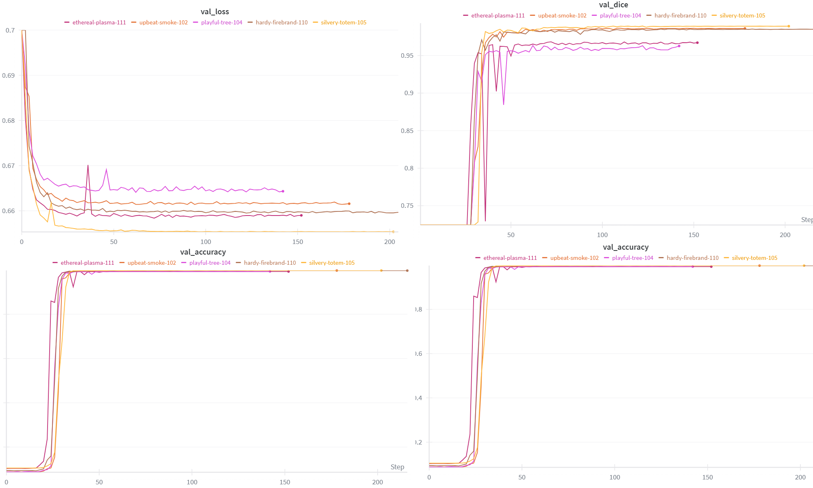
  <div class="slot-label">
    GRÁFICO IPRE / U-NET
    <small>Gráfico de entrenamiento, desempeño o métricas del modelo</small>
  </div>
</div>

---

# EMBEDDED SYSTEMS & FPGA {#embedded-systems-fpga}

## FPGA Upgrade — Universal Testing Machine {#fpga}

Development of an FPGA-based processing board for a universal mechanical testing machine.

The system processes signals associated with **force, displacement, deformation and speed** using
**Zybo Z10, Vivado and VHDL**.

---

# CAD & PROTOTYPING {#cad-prototyping}

## Vscan Air — Medical Device Enclosure {#vscan}

3D design work for a cover / enclosure associated with the GE Vscan Air portable ultrasound transducer.

### Work

- CAD design.
- 3D modeling.
- Geometric adaptation.
- Medical-device-oriented prototyping.

<div class="image-slot">
  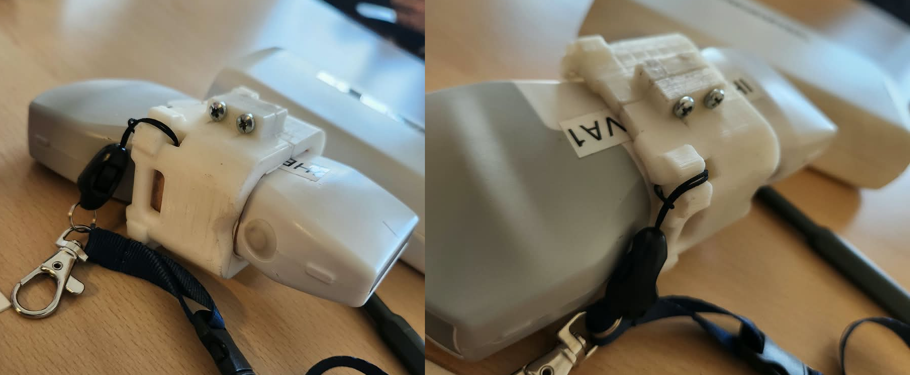
  <div class="slot-label">
    DISEÑO / DISPOSITIVO
    <small>Vista del dispositivo o diseño de cubierta de manera aislada</small>
  </div>
</div>

<div class="image-slot">
  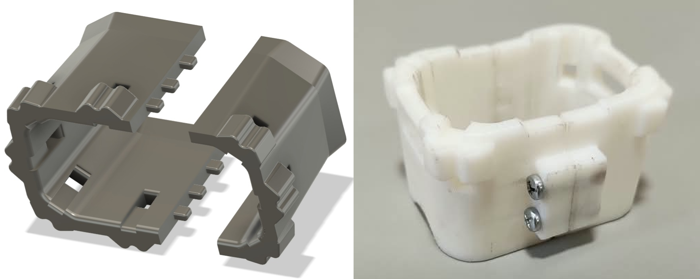
  <div class="slot-label">
    PROTOTIPO FÍSICO
    <small>Pieza real fabricada mediante prototipado o impresión 3D</small>
  </div>
</div>

<div class="image-slot large">
  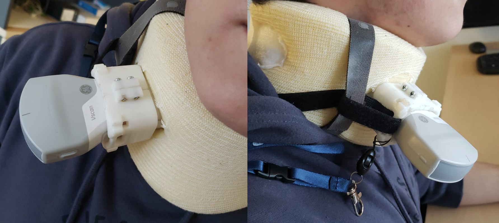
  <div class="slot-label">
    PROTOTIPO EN USO
    <small>Prototipo instalado o utilizado con el Vscan Air</small>
  </div>
</div>
